

    

# On the search for trusted NEO/GAS onchain automatic transfers: nep-distributed-payments

## Guidelines for a adapting/using the `simplePrototype.cs`

Congratulations to all of us!
Good key contributions were made necessary for the achievement of the insights described here.

In particular, thanks to Igor Coelho, from NeoResearch, and Li Jianyang, from NEL team.

As can be noticed, with this simple guidelines, **future development on NEO Ecosystem** could consider Automatic Transfer of NEO/GAS without any offchain untrusted step.

All steps are registered in the blockchain and the owner of the Contract would not be able to steal funds and do not reward.

Current, as will be seen during the next steps, there is not standard for this procedure.
Even it does not require any current additional functionality, we propose a new standard for this type of **Distributed Payments**, which would surely help light wallets to perform all steps accordingly.

## Simple steps to be followed on the [NeoCompiler Eco](https://neocompiler.io):
------------------------------------------------------------------------------------------------

###### S1 - Deploy the contract, storage is needed

###### S3 - Transfer some initials funds to the address of the deployed contract

###### S3 - Call a method that register the address, values to withdraw and utxo(s)

The current design required the following application invoke:
`"method" ["address","values(not used yet)+00000000",b"utxo" (reverted)]`

In python: `"5265636f72645472616e73666572416e645554584f" ["AK2nJJpJr6o664CWJKi1QRXjqeic2zRp8y","200000000",b"ee4a22d100d3122d17e390f26a8f48d1e8f978a05a7d1ab97701191f6ecd4039"]`

This step register that `AK2nJJpJr6o664CWJKi1QRXjqeic2zRp8y` will receive `2 NEO OR GAS` (a filter can be done) from UTXO `ee4a22d100d3122d17e390f26a8f48d1e8f978a05a7d1ab97701191f6ecd4039` (reverted)

###### S4 - Call verification/withdraw transaction
The `verification` trigger can be seen as a kind of `withdrawn transaction`.

* Verification: 0000

* Outputs: current, the first line should be the single address to withdraw
    * `e9eed8dc39332032dc22e5d6e86332c50327ba23` (script hash of `AK2nJJpJr6o664CWJKi1QRXjqeic2zRp8y`)
    * Scripthash of the contract
    * Future improvement:

* Values: Select, precisely, the value registered in the blockchain to be withdrew by the aforementioned address

##### Future steps

* Improve the simple template to allow multiple UTXO, consider a vector of address to withdraw with the same S4. Then, S3 can be done in parallel. Or OPTION 2: Create a function that merge UTXO, then, than, multiple UTXO will not be needed.
* Minor:
  * Limit the Neo or Gas by asset id registered
  * Several other standards

### Illustrative examples

#### Deploy
Copy the code at `simplePrototype.cs`

 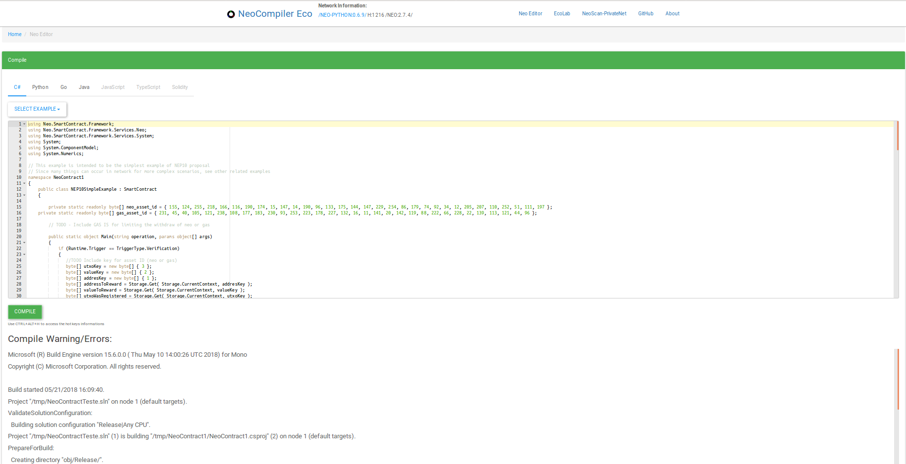

#### Copy the AVM

Copy the compiled AVM opcodes.
Their are going to be used in the verification/withdrawn transaction invoking process.

 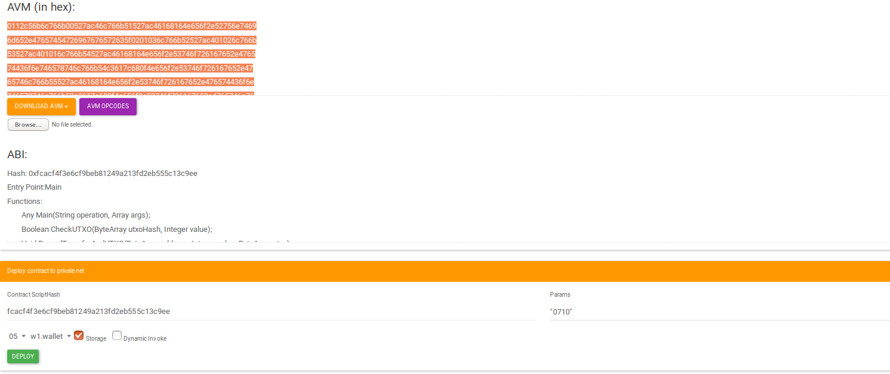

#### Paste the AVM on the EcoLab Transaction Build
The enviroment contain the tools required for the automatic transfer

 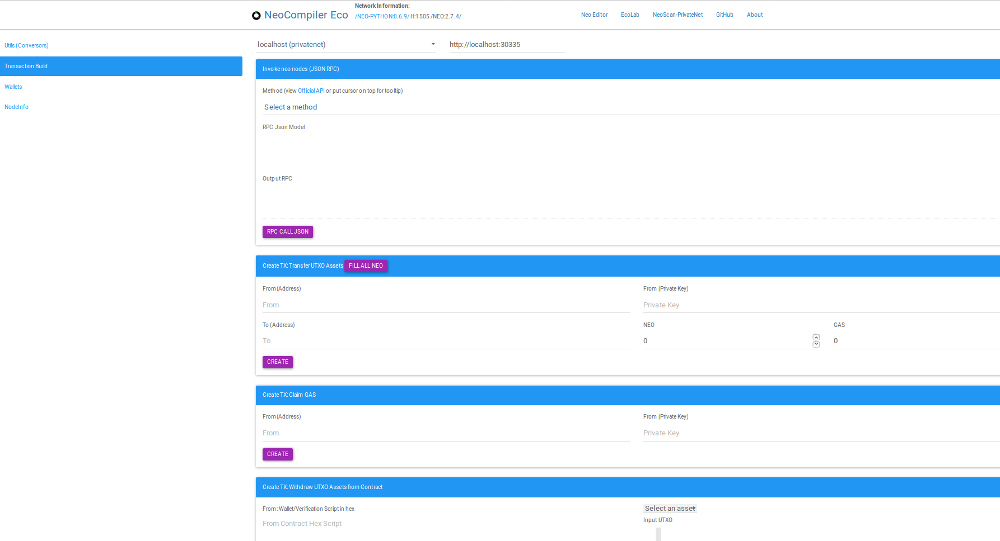

Paste the AVM and copy the Address for making a transfer

 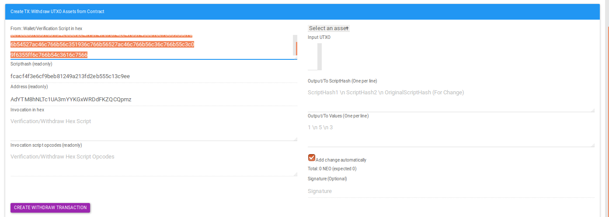

#### Transfer some funds from one of the NeoCompiler wallet

This step could be, for example, the MintToken of an ICO.
The ICO template would register the amount contributed.

 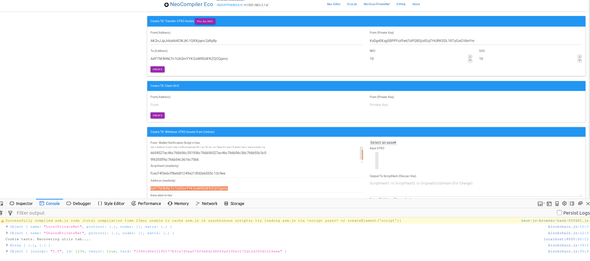

#### Selecting an UTXO: This steps will be automatic from the light wallets
We need to select a desired INPUT UTXO for registering it to be withdrew.

 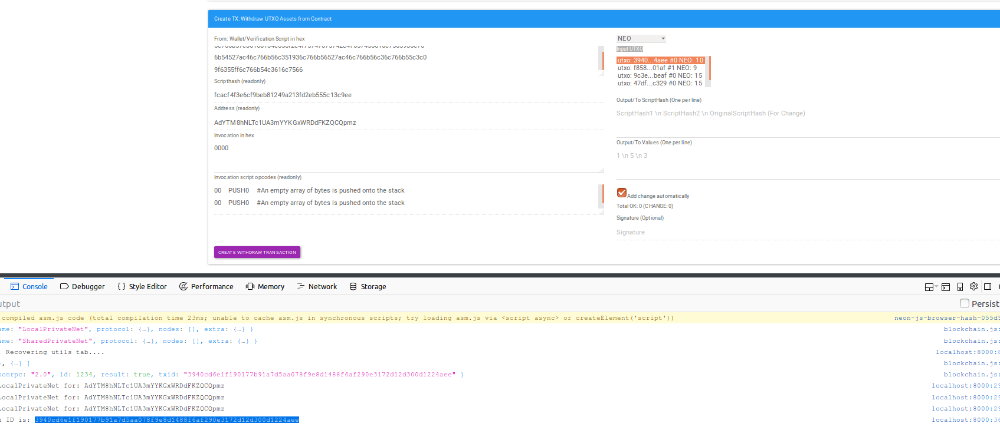

#### Revert the TX ID
As standard, the hex should be reverted

 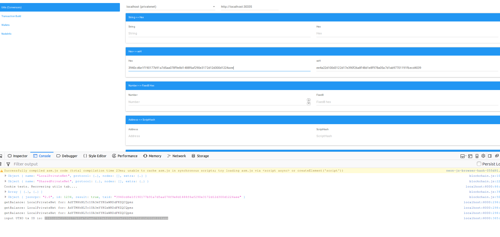

#### Invoke using application Trigger
This step should the check the ammount that the invoking address will/can withdraw. It also register the input UTXO given as parameter (only if it contains the necessary ammount of funds)

 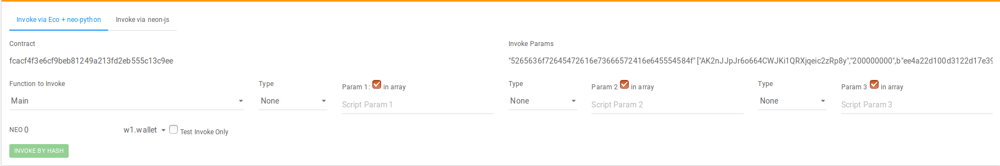

#### Proceed with the automatic reward/withdraw

##### Not registered withdraws will return FALSE

Try using a different UTXO

 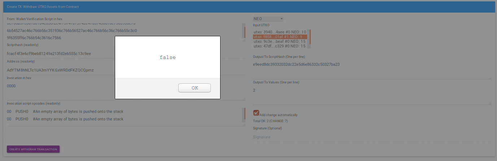

Try to get a different value

 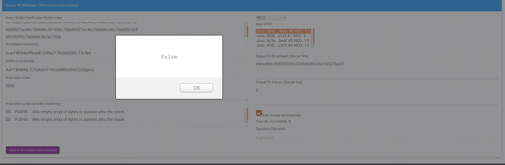

##### Make a successful verification/withdraw transaction

 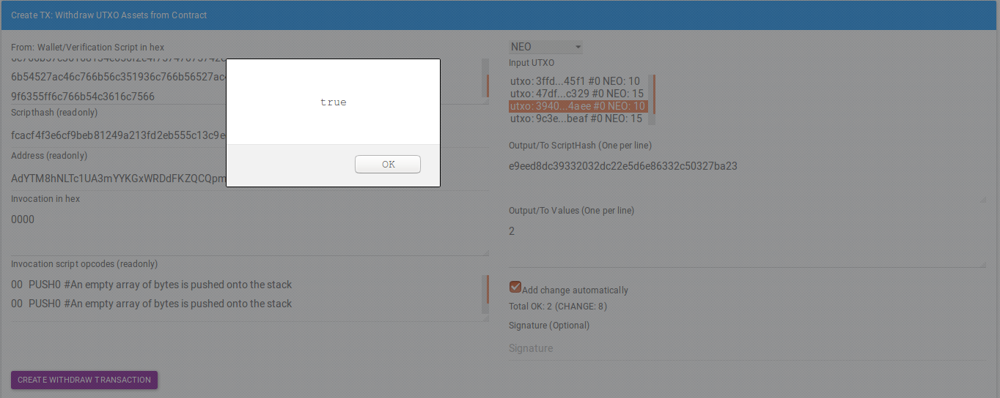

